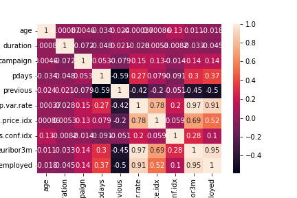

### Business Understanding

#### Business Objective

The primary business objective is to determine whether a person is likely to subscribe to a term deposit when presented with marketing offers.

#### Data Mining Goals

Given the dataset of 426K vehicle purchases which includes the features (id, region, year, manufacturer, model, condition, cylinders,
fuel, odometer, title_status, transmission, VIN, drive, size, type, paint_color, state) along with the target selling price, determine which features are most important in determining the price paid for a used vehicle. The desired output is a list of the most important features in rank order.  

#### Project Plan

1) Aquire and explore the dataset for understanding
2) Prepare the data including cleaning and preprocessing
3) Try various modeling techniques in order to find the best model fit for the data and feature importance
4) Evaluate model outputs and repeat steps 3 & 4 as needed
5) Document analysis findings

### Data Understanding

#### Collect Initial Data
The provided dataset contains historical records that includes: demographics of the person, information about the offer(s), when the offers were made,
and broad economic indicators. 

#### Data Description

##### Dataset contains 41188  rows 
 
##### Identify Numeric and Categorical Columns
Numerical Columns: ['age', 'duration', 'campaign', 'pdays', 'previous', 'emp.var.rate', 'cons.price.idx', 'cons.conf.idx', 'euribor3m', 'nr.employed']
Categorical Columns: ['job', 'marital', 'education', 'default', 'housing', 'loan', 'contact', 'month', 'day_of_week', 'poutcome', 'y']

##### Explored Relationship of Numerical Columns
* Consider Dropping columns euribor3m and emp.var.rate since they are highly correlated with nr.employed\
* 

### Data Preparation

##### Data Selection
*  As instructed, Used just the bank information features (columns 1 - 7) and prepared the features and target column for modeling with appropriate encoding and transformations.
 
### Modeling
##### Established a baseline model

##### Trained basic (default settings) models for Logistic Regression, KNN, Decision Tree, and SVM with the following results:

##### Observations for basic models
- the difference in training times between LogReg, KNN, and Decision Tree is not significant since they are all < 1 sec.
- The SVM takes considerable longer to train
- They don't improve on the baseline model at least partly because the training data is heavily imbalanced.
Some potential ways to address this would be to a) gather more examples of subscription acceptance b) generate synthetic data with acceptance or c) reduce the number of non exceptance

##### Trained models using Hyperparamter Tuning, GridSearch, and Crossfold Validation with the following results:

##### Observations for the improved models
- the relationship between the training times is similar to the basic models 
- They extra hyperparameters has led to a small improve over the baselince and basic models
- More data columns and balancing the data would likely lead to higher accuracy

##### Attempt to improve model accuracy by supplying addition marketing details info to the training dataset (
New training dataset includes: ['age','job','marital','education','default','housing','loan','contact','duration','campaign','pdays']

##### Trained models on the additional data using using Hyperparamter Tuning, GridSearch, and Crossfold Validation similar to above with the following results:
TODO
1. Add Chart

TODO after this

##
### Evaluation
#### Summary of Results
1. Multiple Linear Regression, Ridge, and Lasso were trained on a subset of the initial data and regardless of the model type the rank of feature importance was
    1. year
    2. model
    3. odometer
    4. type
    5. drive
    6. cylinders
    7. manufacuturer
    8. condition
    10. paint color.
2. This lines up with general expectations on what buyers typically prioritize when purchasing a vehicle

##### Possible Next Steps
1. There was considerable missing data in the dataset so it could be useful to impute the missing values vs. just deleting the rows that were missing any data
2. State was not factored into the modeling since there was a very uneven distribution of data. One potential way to address this would be to bucket the state values into 
US subregions such as North East, Mid-West, etc. to understand how price varies by selling location.
3. Explore other feature importance methods such as permutation_importance
4. As usual, having more data, especially data that helps have more records from the less common models, types, etc. would likely be usefull in getting more accurate predictions.

#### The Jupyter Notebook used to analyze the data can be found at [prompt_II.ipynb](./prompt_II.ipynb)
